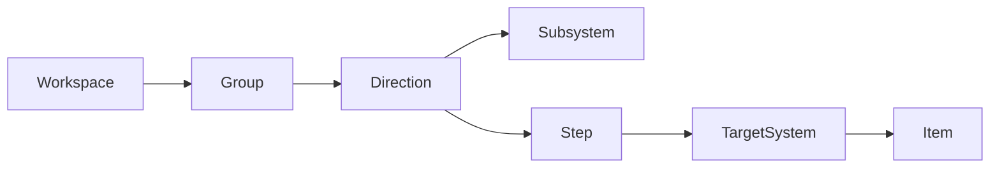

# MVP: UI → API → Модель данных (по 4 экранам)

## 0) Термины (черновые)
- **Workspace**: “онтология компании/группы компаний” — единица подписки realtime.
- **Level-01**: группы направлений деятельности + направления (карточки).
- **Level-02**: направление (детализация): подсистемы (зелёные), цепочка шагов (синие), целевая система (оранжевая).
- **Level-03**: целевая система/контейнер: колонки сущностей (“воплощения/описания/методы/работы”).
- **Level-04**: карточка сущности с вкладками.

> Допущение (пока не уточнено): будет **multi-tenant** через `workspaceId` (каждая компания/команда = workspace). Если окажется single-tenant — упрощаем auth и схему.

---

## 1) Экран → API → Модели → Компоненты → Edge cases

### 1.1 Level-01: “направления деятельности” (page_level-01)

| Экран | API (команды/чтение) | Модели данных | UI компоненты | Edge cases |
|---|---|---|---|---|
| Список групп и направлений | `GET /workspaces/:id/level1` | `Workspace`, `Group`, `Direction` | `TopLevelNav`, `GroupSection`, `DirectionCard`, `AddButton` | пустой workspace; DnD между группами; права доступа |
| Создать группу | `POST /groups` | `Group` | `CreateGroupModal` | уникальность имени (по желанию); порядок групп |
| Создать направление | `POST /directions` | `Direction` | `CreateDirectionModal` | порядок внутри группы |
| DnD направлений | `POST /directions/reorder` | `Direction.order` | `DnDList` | “optimistic UI” + откат; конкурирующие апдейты |

**Интерактив:**\n- клик по `DirectionCard` → переход на Level‑02 (`/directions/:id`).\n- DnD карточек: менять порядок и группу.\n
### 1.2 Level-02: “направление Предметы” (page_level-02)

| Экран | API (команды/чтение) | Модели данных | UI компоненты | Edge cases |
|---|---|---|---|---|
| Состав направления | `GET /directions/:id/level2` | `Direction`, `Subsystem`, `Step`, `TargetSystem` | `LevelNav`, `SubsystemGrid`, `StepChain`, `TargetCard` | авто‑позиция оранжевого; гарантии “1 target”; DnD в разных списках |
| Добавить подсистему (зелёная) | `POST /subsystems` | `Subsystem` | `CreateSubsystemModal` | порядок; видимость зрителям realtime |
| Добавить шаг (синий) | `POST /steps` | `Step` | `CreateStepModal` | новый шаг всегда в конец; обновить стрелки |
| DnD подсистем | `POST /subsystems/reorder` | `Subsystem.order` | `DnDGrid` | только reorder внутри списка |
| DnD шагов | `POST /steps/reorder` | `Step.order` | `DnDChain` | стрелки всегда слева→направо; target всегда под последним |
| Переход на Level‑03 | `GET /targets/:id` | `TargetSystem` | `TargetCardLink` | доступ к соседним направлениям через верхнюю панель |

**Правила модели (важные):**\n- **TargetSystem**: один экземпляр на `Direction`; расположен **под последним** `Step`.\n- **Step**: упорядоченная цепочка; визуальные “стрелки” отражают `order`.\n
### 1.3 Level-03: “проекты предметов” (page_level-03)

| Экран | API (команды/чтение) | Модели данных | UI компоненты | Edge cases |
|---|---|---|---|---|
| Колонки сущностей | `GET /targets/:id/level3` | `TargetSystem`, `Item` | `ColumnBoard`, `Column`, `ItemRow`, `AddButton` | DnD внутри колонки (воплощения); позже — между колонками |
| Создать элемент в колонке | `POST /items` | `Item` | `CreateItemModal` | тип/колонка; порядок |
| DnD внутри “Воплощение” | `POST /items/reorder` | `Item.order` | `DnDList` | optimistic UI; конкурентные события |
| Переход на Level‑04 | `GET /items/:id` | `Item` | `ItemLink` | вкладки/разделы растут со временем |

### 1.4 Level-04: “дизайн-проекты предметов быта” (page_level-04)

| Экран | API (команды/чтение) | Модели данных | UI компоненты | Edge cases |
|---|---|---|---|---|
| Детали сущности | `GET /items/:id` | `Item`, `ItemTab` | `Tabs`, `RichSection`, `TableSection` | большой объём данных; autosave; права |
| Сохранить изменения | `PUT /items/:id` | `Item` | `AutosaveIndicator` | single-writer lock; конфликт версии; offline |

---

## 2) Модель данных (MVP)

### 2.1 Минимальная схема (рекомендовано: универсальная “node+edge”)

**nodes**
- `id` (uuid)
- `workspace_id` (uuid)
- `kind` (enum): `group`, `direction`, `subsystem`, `step`, `target`, `item`
- `parent_id` (uuid, nullable) — для иерархий/контейнеров
- `title` (text)
- `meta` (jsonb) — цвет/таб/колонка/любой специфичный payload
- `order_index` (int) — порядок в рамках `parent_id + kind` (или в рамках “колонки”)
- `created_at`, `updated_at`

**edges**
- `id` (uuid)
- `workspace_id`
- `from_node_id`
- `to_node_id`
- `kind` (enum): `creates`, `influences`, `parent_link`
- `meta` (jsonb)

**locks** (single-writer)
- `workspace_id`
- `resource_kind` (`direction|target|item|...`)
- `resource_id`
- `owner_user_id`
- `expires_at`

### 2.2 Mermaid (концептуально)

---

## 3) API (черновой контракт)

### 3.1 Чтение
- `GET /workspaces/:workspaceId/level1` → группы + направления (sorted)
- `GET /directions/:directionId/level2` → подсистемы + шаги + target
- `GET /targets/:targetId/level3` → колонки + элементы
- `GET /items/:itemId` → детали + вкладки

### 3.2 Команды (write)
- `POST /groups` `{workspaceId,title}` → group
- `POST /directions` `{groupId,title}` → direction
- `POST /subsystems` `{directionId,title}` → subsystem
- `POST /steps` `{directionId,title}` → step (авто `order_index = last+1`)
- `POST /items` `{targetId,columnKey,title}` → item

- `POST /directions/reorder` `{workspaceId,moves:[{directionId,toGroupId,toIndex}]}`  
- `POST /subsystems/reorder` `{directionId,order:[subsystemId...]}`  
- `POST /steps/reorder` `{directionId,order:[stepId...]}`  
- `POST /items/reorder` `{targetId,columnKey,order:[itemId...]}`  

- `PUT /items/:itemId` `{patch...}` → item

### 3.3 Locks (single-writer)
- `POST /locks/acquire` `{resourceKind,resourceId}` → ok/denied
- `POST /locks/release` `{resourceKind,resourceId}` → ok

---

## 4) Realtime (WebSocket): события по workspace

### 4.1 Подключение
- Клиент подключается → `SUBSCRIBE workspaceId`
- Сервер отправляет `workspace.snapshot` (опционально) или клиент параллельно делает initial `GET`.

### 4.2 События (минимальный набор)
- `lock.acquired` / `lock.released`
- `node.created` / `node.updated` / `node.deleted`
- `node.reordered` (payload: `parentId/kind/columnKey + newOrder`)
- `edge.updated` (для creates/influences, если потребуется)

**Все события содержат:**
- `eventId`, `workspaceId`, `actorUserId`, `ts`
- `version` (монотонная версия workspace или коллекции)
- `payload` (минимальный патч)

### 4.3 Клиентская стратегия
- optimistic UI на редакторе
- зрители: применяют события сразу; при gap по `version` → делают refetch нужного ресурса

