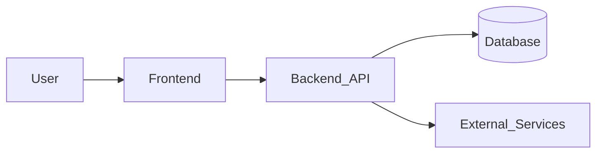
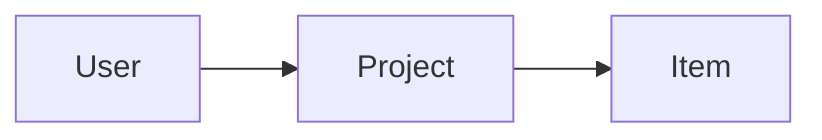

# Описание архитектуры (Architecture Description) — Lite

**Назначение:** кратко и однозначно описать архитектуру так, чтобы решения были проверяемыми и пригодными для эксплуатации.

## 1. Контекст (Context)
- **System scope:** что входит / что не входит.
- **Actors:** пользователи/сервисы/внешние системы.
- **Environment:** dev/stage/prod, хостинг/сеть, ограничения.

## 2. Стейкхолдеры и интересы (Stakeholders & Concerns) — Lite

| Stakeholder | Concerns (что важно) |
|---|---|
| ProductOwner | ценность, сроки, MVP‑границы |
| Users | UX, скорость, надёжность |
| DevTeam | DX, поддерживаемость, скорость разработки |
| Ops/SRE | деплой, логи, мониторинг, бэкапы, инциденты |
| Security/Compliance | секреты, доступы, аудит, уязвимости |

## 3. Атрибуты качества (Quality Attributes / NFR)
- **Security:** authn/authz, защита секретов, OWASP‑минимум.
- **Reliability:** healthchecks, retries/timeouts, graceful errors.
- **Performance:** бюджеты (TTFB/LCP), кэширование, индексы.
- **Maintainability:** типизация, линт, модульность.
- **Observability:** логи/метрики/трейсы (минимум).

## 4. Допущения и ограничения (Assumptions & Constraints)
- **Assumptions:** …
- **Constraints:** (язык/стек/бюджет/регуляторика) …

## 5. Точки зрения и представления (Viewpoints & Views) — Lite

### 5.1 Логическое представление (Logical view): сервисы и границы
- **Modules/services:** …
- **Responsibilities:** …
- **Interfaces:** …

### 5.2 Представление данных (Data view): сущности и связи
- **Core entities:** …
- **Relationships:** …
- **Migrations/seed strategy:** …

### 5.3 Представление разработки (Development view): репо и сборка
- **Repo structure:** …
- **Tooling:** lint/format/types/tests …
- **CI:** steps, gates …

### 5.4 Представление деплоя (Deployment view): инфра и прод
- **Runtime:** Docker/VM/PaaS …
- **Networking:** домен/SSL/прокси …
- **Secrets:** где храним и как ротируем …
- **Backups:** что/как часто/как восстанавливаем …

## 6. Ключевые решения (Key decisions)
- См. `project-controls.md` (раздел “Decision log”)

## 7. Риски и снижения (Risks & Mitigations)
| Risk | Impact | Mitigation | Status |
|---|---|---|---|
| … | … | … | open/mitigated |

## 8. Верификация (Verification): как докажем, что архитектура работает
- **Smoke checks:** …
- **E2E checks:** …
- **Operational checks:** миграции/бэкапы/логи …

